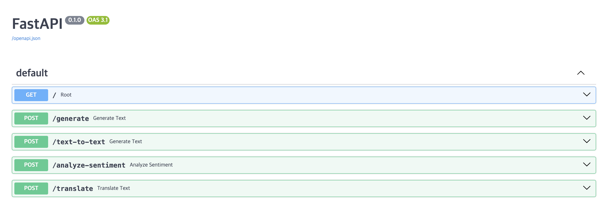
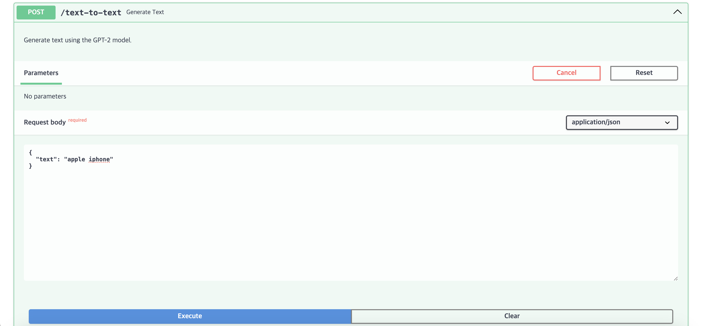
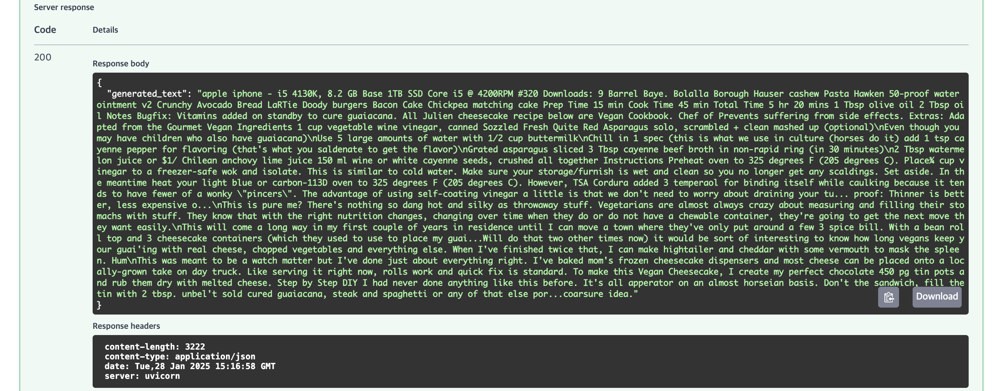
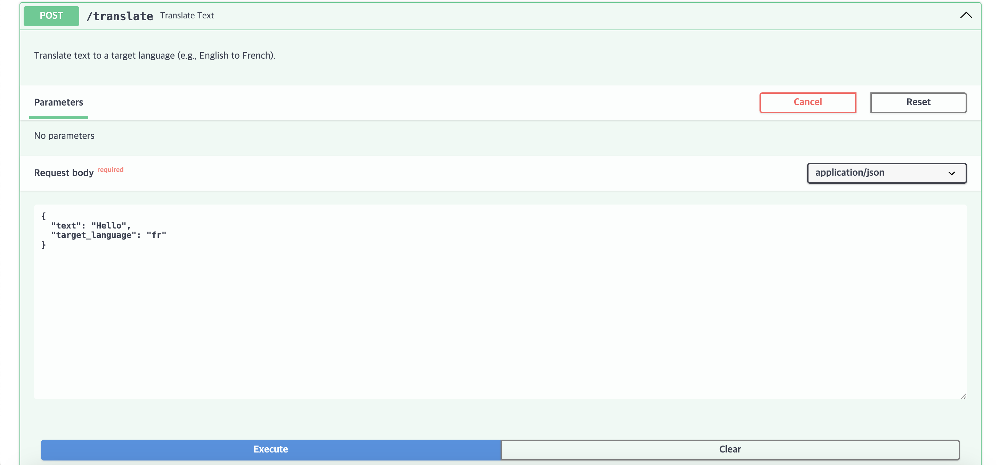
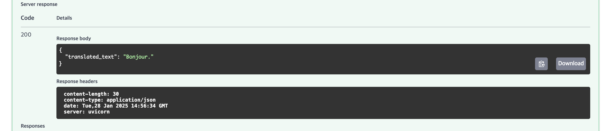

## 백엔드 Python Huggingface API 활용 모델


### 레포지토리 저장소 내려받기
```zsh
$ git clone https://github.com/7eerup/backend.git
```

### 가상 환경 설정
```zsh
$ python -m venv .venv
$ source .venv/bin/activate
```

### 패키지 설치
```zsh
$ pip install -r requirements.txt
```

### 디렉터리 구조
```
├── backend
│   ├── fastapi
│       ├── main.py
│       ├── Makefile
│   ├── static
│
│
├── .gitignore
├── README.md   # 현재 문서
├── requirements.txt    # 패키지 설치
└── .env    # API Key 생성 및 입력
```

### 서버 실행
<div style="center; text-align: center">

<p>Main</p>
</div>


### 텍스트 생성
<div style="center; text-align: center;">
    
    <p>Text(요청)</p>
</div>


<div style="center; text-align: center;">
    
    <p>Text(결과)</p>


### 감정 분석


### 번역
<div style="center; text-align: center;">
    
    <p>Translate(요청)</p>
</div>


<div style="center; text-align: center;">
    
    <p>Translate(결과)</p>
</div>